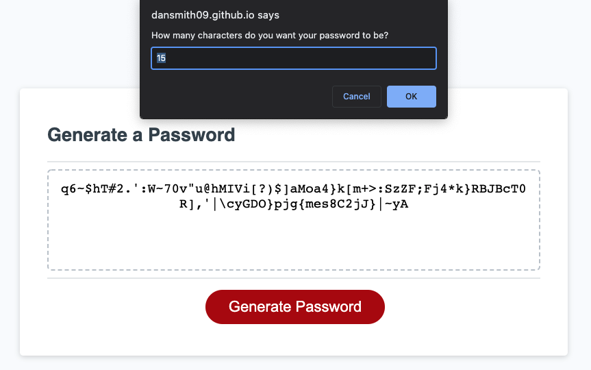
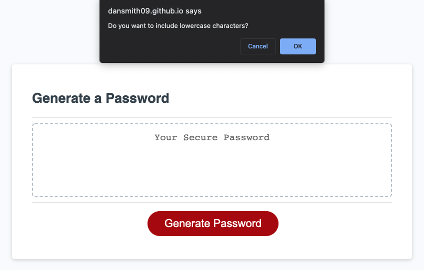
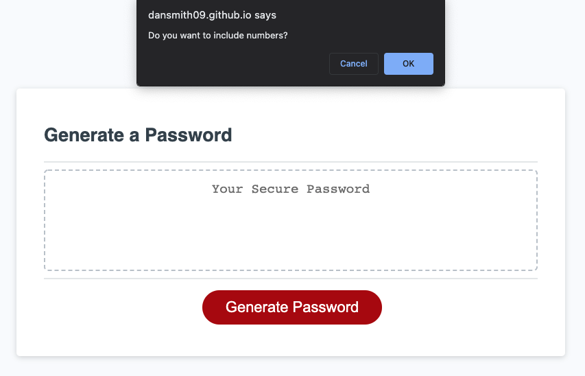
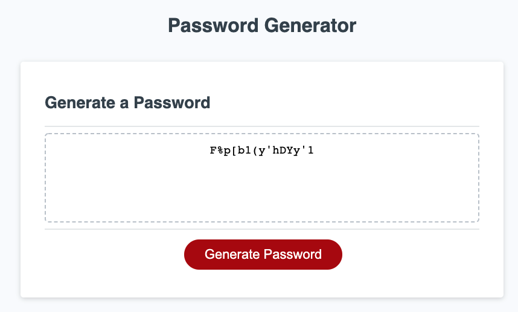
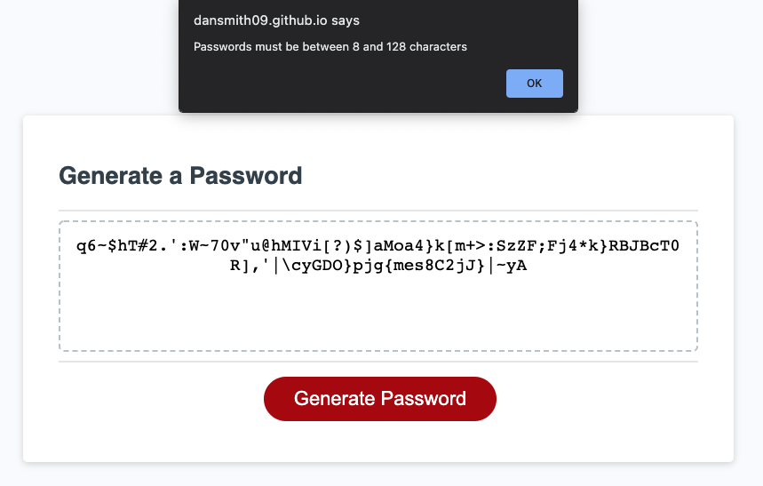
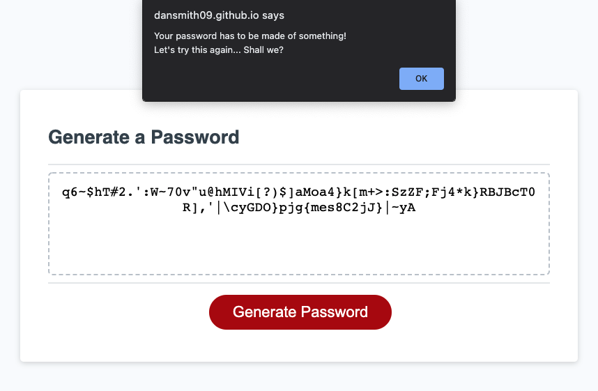

# Dan-Smith-03-Password-Generator-JavaScript

**Description**

This website is designed to generate a password for the user.
It takes into account:
- how many characters the user wants the password to be.
- What kind types of characters the user wants to include in the password

The program then takes these selections and randomizes a password.

**Mockup Website Link**

Website link:
https://dansmith09.github.io/Dan-Smith-03-Password-Generator-JavaScript/

**Website Section Screenshots**

The screenshots below show the tree or flow of the site:

When 'Generate Password' button is selected:

After the user selects how many characters their password should be:

After the user selects if they want lowercase characters:

After the user selects if they want uppercase characters:

After the user selects if they want special characters:

After the user selects if they want numbers, the password is then generated:

There are a couple of scenarios where the user needs to be redirected. These include:

When the user selects a number of characters that is lower than 8 or greater than 128
The process is then started again

When the user doesnt select any kind of character types to be included in their password:

